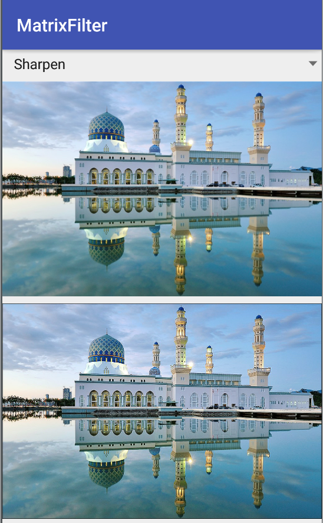
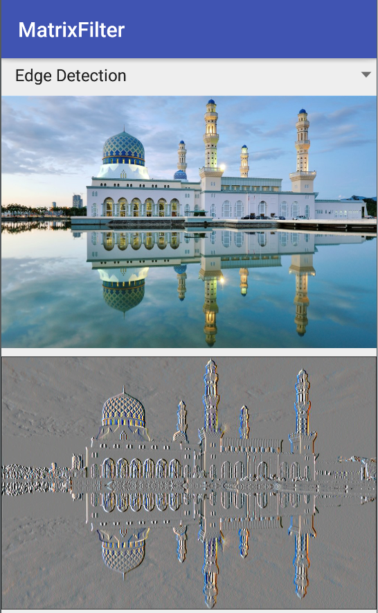
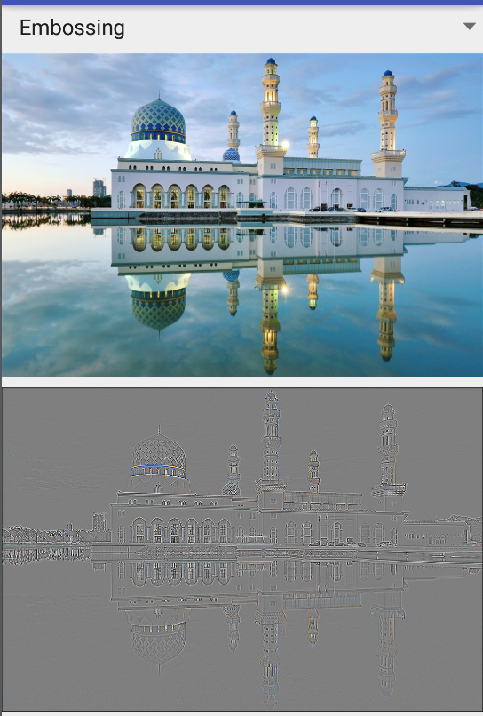

# libs-imageFilter 简要说明
## 目的
本库主要是对图片进行一系列的处理，比如浮雕样式（embossing处理），高斯模糊、图片高亮处理。
例如对图片的做embossing，其实是对图片做 Laplace 矩阵变换 。
那么就有一种方式：即传入相应的矩阵是否可以得到相应的图片？
## 常用矩阵
- 图像的锐化滤波器Sharpness Filter:
强调图像边缘
常用{0,-1,0,-1,5,-1,0,-1,-1}  ;
{-1,-1,-1,-1,9,-1,-1,-1,-1};
{-k,-k,-k,-k,8k+1,-k,-k,-k,-k}
计算当前点和周围点的差别,然后将差别加到原来的位置上,中间点到权值比所有的权值\>1,表示这个像素保持原来的值;
 
- 边缘检测Edge Detection
所有元素的和为0,所以滤波后的图像只有边缘是有亮度的
常用{-1,-1,-1,0,0,0,1,1,1};
{-1/8, -1/8, -1/8, -1/8,1, -1/8, -1/8, -1/8, -1/8}
这种方式会将图片的噪点也放大

- 浮雕Embossing Filter
将中心像素的值减去另一边的像素值,将得到的负值变为阴影,正数变成光,加上127(或128)的偏移值,这个值是图片的灰度范围;
常用:{2,0,0,0,-1,0,0,0,1}

- 均值模糊 Box Filter(Averaging)
取当前像素和它4个领域的像素取均值除以5,如果需要加大模糊效果,加大滤波器效果即可,或者对图片做多次模糊
常用:{1/9, 1/9, 1/9, 1/9, 1/9, 1/9, 1/9, 1/9, 1/9}
- 高斯模糊(Gaussian Blur)
相比均值模糊,会更加平滑,通常用于图片的降噪上,特别实在边缘检测中都用于移除细节,是一个低通滤波器;
常用:{1,2,1,2,4,2,1,2,1}

